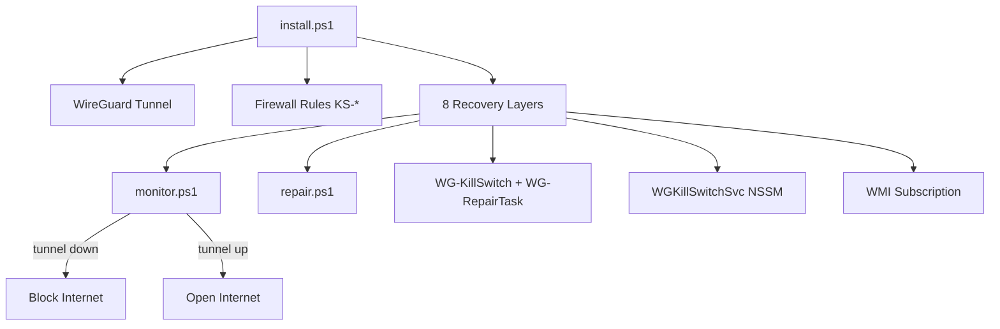

# Windows WireGuard Kill Switch (WARP Auto-Setup)


> **One script. No config. No personal info. Full kill switch.**

Automatically installs WireGuard + Cloudflare WARP on Windows with a hardened kill switch that blocks all traffic if the VPN drops. **v10.6** is the production-hardened release with custom server support.

**Keywords:** Windows WireGuard kill switch · VPN leak protection · Cloudflare WARP auto setup · PowerShell firewall · custom WireGuard server · wgcf · anonymous VPN · censorship circumvention

> **Language:** Documentation, issues, discussions, and support are **English only**. Please open issues and ask questions in English.

**Reviewing the code?** See **[docs/CODE_REVIEW.md](docs/CODE_REVIEW.md)** — architecture, reviewer Q&A table, and what changed in v10.6. Latest release: **[v10.6](https://github.com/ryderlacin-pixel/Windows-WireGuard-KillSwitch/releases/tag/v10.6)**.

---

## Architecture



---

## What it does

1. **Downloads & installs WireGuard** silently (if not already installed)
2. **Downloads wgcf** and generates an **anonymous** Cloudflare WARP account — no email, no login
3. **Applies a kill switch** via Windows Firewall that blocks all internet traffic unless the VPN tunnel is active
4. **Installs 8 redundant recovery layers** so the VPN restarts automatically after crashes or reboots

No personal data is stored anywhere. The WARP registration is completely anonymous.

---

## Real-world testing

> **Tested in Turkey**, where many websites are blocked at the ISP level by government filtering (DNS/IP blocks, restricted access to social media, news, and international services).

In that environment, the combination of **Cloudflare WARP + this kill switch** worked well in daily use:

| Concern | How this setup handles it |
|---------|---------------------------|
| **State-level blocks** | WARP routes traffic through Cloudflare's network, bypassing most common ISP/DNS blocks for everyday browsing |
| **VPN drops** | Kill switch blocks all outbound traffic immediately — no accidental leak onto a filtered or unprotected connection |
| **Reboot / crash** | 8 recovery layers restart the tunnel automatically; block stays active until the tunnel is confirmed running |
| **DNS leaks** | Firewall allows DNS only to `1.1.1.1` / `1.0.0.1`; all other DNS outbound is blocked |

Validated on **Windows 11** with production use across multiple reboots (v10.0+). Not a lab test — real machine, real network, real blocks.

**Caveats (honest):**
- Effectiveness depends on the type of block (DNS, IP range, or deep packet inspection). WARP handles most ISP-level filtering; it is **not** a guarantee against every censorship technique.
- WARP is Cloudflare's consumer VPN — throughput and latency vary by region.
- Custom server mode (`-CustomConfig`) works the same way; point firewall rules at your own endpoint.

*Personal testing note — not legal advice. Users are responsible for complying with local laws.*

---

## Requirements

- Windows 10 / 11 (x64)
- PowerShell 5.1+
- Run as **Administrator**
- Internet access during setup

---

## Installation

### Default — Cloudflare WARP (anonymous)

```powershell
# 1. Download install.ps1
# 2. Right-click → "Run with PowerShell" as Administrator
#    OR open an elevated PowerShell and run:

Set-ExecutionPolicy Bypass -Scope Process -Force
.\install.ps1
```

That's it. No manual WireGuard setup. No account creation. Fully automated.

### Custom WireGuard server

Use your own `.conf` file instead of WARP. WireGuard is still installed automatically; only wgcf/WARP generation is skipped.

**Minimum** — endpoint and port are read from the config file:

```powershell
.\install.ps1 -CustomConfig "C:\path\to\myvpn.conf"
```

Tunnel name defaults to the config filename (`myvpn.conf` → tunnel `myvpn`).

**Full control:**

```powershell
.\install.ps1 `
  -CustomConfig "C:\path\to\myvpn.conf" `
  -CustomTunnel "myvpn" `
  -CustomEndpointIP "1.2.3.4/32" `
  -CustomPort 51820
```

| Parameter | Required | Description |
|-----------|----------|-------------|
| `-CustomConfig` | Yes (custom mode) | Path to your WireGuard `.conf` file |
| `-CustomTunnel` | No | Tunnel/service name (default: config filename) |
| `-CustomEndpointIP` | No* | Server IP or CIDR for firewall allow rule |
| `-CustomPort` | No* | WireGuard UDP port (default: `51820`) |

\*If omitted, `Endpoint = IP:PORT` is parsed from the config file.

Custom settings are baked into generated `monitor.ps1`, `repair.ps1`, and GPO scripts at install time, and stored in `HKLM:\SOFTWARE\WGKillSwitch`.

---

## How the kill switch works

| Situation | Behavior |
|-----------|----------|
| VPN tunnel **running** | All internet traffic flows normally through the tunnel |
| VPN tunnel **drops** | Internet is **immediately blocked** via firewall rules |
| VPN **recovers** | Internet is automatically unblocked, DNS cache flushed |
| System **reboots** | Kill switch activates before any traffic can leak |

### Firewall rules applied

- `KS-Block-WiFi-Out` / `KS-Block-Ethernet-Out` — blocks all outbound traffic on real adapters
- `KS-LAN-*` — allows local network (192.168.x.x, 10.x.x.x, 172.16.x.x)
- `KS-DHCP-*` — allows DHCP so the adapter can get an IP
- `KS-DNS-Allow` — allows DNS only to 1.1.1.1 and 1.0.0.1
- `KS-DNS-Block` — blocks all other DNS (prevents leaks)
- `KS-WARP-Server-Out` — allows UDP to VPN server endpoints (WARP or custom) so the tunnel can reconnect
- `KS-Block-IPv6-*` — blocks all IPv6 (prevents leaks)

---

## Recovery layers (8 total)

If anything goes wrong (crash, update, kill), the system recovers automatically:

| Layer | Description |
|-------|-------------|
| **monitor.ps1** | Main loop — checks tunnel every 5s, recovers if down |
| **repair.ps1** | System repair script — restarts missing components |
| **WG-KillSwitch** | Scheduled task, runs at boot (60s delay) + restarts on failure |
| **WG-RepairTask** | Scheduled task, runs at boot (30s delay) + every 5 minutes |
| **WGKillSwitchSvc** | Windows service via NSSM, delayed-auto-start |
| **WMI Subscription** | Watches for powershell.exe death, triggers repair |
| **Startup shortcut** | `C:\ProgramData\...\StartUp\WGKillSwitch.lnk` |
| **GPO Boot Script** | Machine startup script via Group Policy |

All layers are installed by `install.ps1`. Nothing needs to be done manually.

---

## Files installed to `C:\WireGuard\`

| File | Purpose |
|------|---------|
| `wgcf-profile.conf` | WARP config (auto-generated) or your custom config path |
| `monitor.ps1` | Main VPN monitor loop |
| `repair.ps1` | System repair script |
| `service-monitor.ps1` | NSSM service wrapper |
| `wmi-repair.ps1` | WMI event consumer wrapper |
| `repair.lock` | Single-instance lock for repair script |
| `killswitch.log` | Live log (max 500 lines, auto-rotated) |
| `nssm.exe` | Service manager |
| `wgcf.exe` | WARP config generator (WARP mode only) |
| `WG-KillSwitch-backup.xml` | Task backup for self-repair |

All files except the log are hidden/system-flagged and ACL-protected.

> **Legacy installs (pre-v10.1):** Older versions used Turkish filenames (`onarim.ps1`, `servis-monitor.ps1`, `wmi-onarim.ps1`). Re-running `install.ps1` migrates to the English names above and removes the old files. Existing working installs do not need to be touched manually.

---

## Uninstall

Run the following in an elevated PowerShell. Replace `wgcf-profile` with your tunnel name if you used custom mode:

```powershell
# Stop and remove everything
schtasks /Delete /TN "\WG-KillSwitch" /F
schtasks /Delete /TN "\WG-RepairTask" /F
sc.exe stop WGKillSwitchSvc
C:\WireGuard\nssm.exe remove WGKillSwitchSvc confirm
& "C:\Program Files\WireGuard\wireguard.exe" /uninstalltunnelservice wgcf-profile
Get-NetFirewallRule | Where-Object { $_.DisplayName -like "KS-*" } | Remove-NetFirewallRule
netsh advfirewall set allprofiles firewallpolicy blockinbound,allowoutbound
Remove-Item -Recurse -Force "C:\WireGuard"
Remove-Item -Force "C:\ProgramData\Microsoft\Windows\Start Menu\Programs\StartUp\WGKillSwitch.lnk"
Remove-ItemProperty "HKLM:\SOFTWARE\Microsoft\Windows\CurrentVersion\Run" "WGKillSwitchGuard"
Remove-Item "HKLM:\SOFTWARE\WGKillSwitch" -Recurse
```

---

## Log

```
C:\WireGuard\killswitch.log
```

```powershell
Get-Content C:\WireGuard\killswitch.log -Wait -Tail 30
```

---

## Privacy

- No account is created. The `wgcf register` command generates a random device identity on Cloudflare's WARP network.
- No email, name, or identifying information is collected or stored.
- The generated `wgcf-profile.conf` contains only a private key and Cloudflare's WARP endpoint — nothing personal.

---

## Troubleshooting

**Tunnel won't start**
The monitor will retry up to 5 times, then wait 3 minutes and try again indefinitely. Check the log for details.

**Internet blocked after reboot**
Wait 60–90 seconds. The monitor starts after a boot delay to let the network stack initialize.

**Custom server won't reconnect when tunnel is down**
Ensure `-CustomEndpointIP` matches your server's public IP and `-CustomPort` matches the `Endpoint` port in your `.conf`.

**Want to check status right now?**

```powershell
# Check tunnel (replace wgcf-profile with your tunnel name if custom)
sc.exe query "WireGuardTunnel`$wgcf-profile"

# Check registry install info
Get-ItemProperty "HKLM:\SOFTWARE\WGKillSwitch"

# View live log
Get-Content C:\WireGuard\killswitch.log -Tail 20
```

---

## Changelog

### v10.6
- **Critical fix:** Internet opens only when tunnel is RUNNING **and** `Test-Internet` passes (zombie-tunnel leak prevention)
- Dual-host connectivity check (1.1.1.1 + 1.0.0.1); 3min recovery wait requires full `Test-SafeToOpen`
- Firewall blocks tethering (`remoteaccess`) and PPP interfaces
- WARP mode refreshes Cloudflare server IPs at runtime; log writes skip on mutex timeout
- Monitor detection + WMI subscription include `pwsh.exe`

### v10.5
- **Critical fix:** `AbandonedMutexException` on main monitor mutex no longer causes `exit 0` (monitor could never respawn after Task Manager kill)
- Shared `Wait-NamedMutex` helper across monitor, repair, WMI, service, GPO, and installer log paths
- Tunnel reinstall mutex (`WGTunnelInstallMutex`) uses same abandoned-mutex-safe wait

### v10.4
- Hardened `Test-Internet` (requires successful TCP connect, not just async timeout)
- Strict main-monitor detection everywhere (`IsMainMonitor` regex; WMI uses `\monitor.ps1` path pattern)
- Repair `schtasks` paths fixed; monitor single-instance mutex added
- DNS TCP/UDP block, IPv6 NAT64 ranges, `KS-WireGuard-EXE`, splatting, design-philosophy header (from v10.2–10.3)
- Registry stores resolved WARP server IPs in WARP mode

### v10.1
- Real-world testing section (Turkey / ISP-level blocks + WARP + kill switch)
- Script filenames and internal function names Englishized (`repair.ps1`, `service-monitor.ps1`, `wmi-repair.ps1`)
- Installer removes legacy Turkish-named scripts on upgrade
- Monitor uses `Test-Internet`, `Enable-Block`, `Disable-Block`, `Ensure-ServerRule`, `Try-ReinstallTunnel`

### v10.0
- **Critical fix:** process detection no longer confuses `servis-monitor.ps1` with `monitor.ps1` (prevents monitor kill loop)
- Repair script firewall check fixed (no more false "policy corrected" every 5 minutes)
- Scheduled tasks survive battery mode (`AllowStartIfOnBatteries`, `DontStopIfGoingOnBatteries`)
- Service monitor uses 60s interval + 2-minute repair cooldown (prevents repair storms)
- Dual tunnel health check (`Get-Service` + `sc.exe`)
- WMI + repair only target the main `monitor.ps1` process
- Migrates legacy `WG-OnarimGorevi` to `WG-RepairTask` on upgrade

### v1.1
- Custom WireGuard server support via `-CustomConfig`, `-CustomTunnel`, `-CustomEndpointIP`, `-CustomPort`
- Endpoint/port auto-parsed from `.conf` when not specified

### v1.0
- Initial release: WARP auto-setup + 8-layer kill switch

---

## License

MIT — do whatever you want with it.