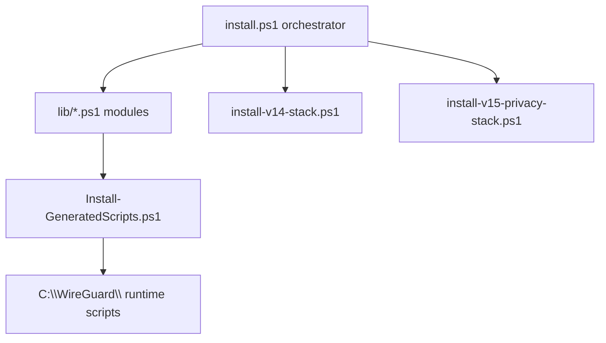
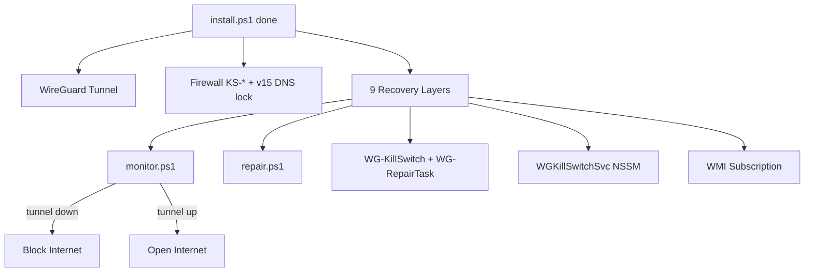

# Windows WireGuard Kill Switch (WARP Auto-Setup)


> **One command (`.\install.ps1`). Modular code (`lib/`). Full kill switch. Boot-safe (v15.2.3). Strong privacy (v15).**

Automatically installs WireGuard on Windows with a hardened kill switch and **v15 strong privacy** (system DNS lock, encrypted DNS, browser/telemetry hardening). **Default (recommended):** free anonymous Cloudflare WARP — no signup, no monthly fee. **Optional:** paid WireGuard VPN via `-CustomConfig` if you have a provider. **Sensitive browsing:** desktop **Hassas-Tarama** (Tor, one-step in v15.1+).

**v15.2** is the current production release (boot-safety patch — see [post-mortem](docs/releases/v15.2.md)).

**Keywords:** Windows WireGuard kill switch · VPN leak protection · Cloudflare WARP auto setup · PowerShell firewall · custom WireGuard server · wgcf · anonymous VPN · censorship circumvention

> **Language:** Documentation, issues, discussions, and support are **English only**. Please open issues and ask questions in English.

**Reviewing the code?** See **[docs/CODE_REVIEW.md](docs/CODE_REVIEW.md)**. Latest release: **[v15.2.3](docs/releases/v15.2.3.md)**. Implementation modules: **`lib/`** (dot-sourced from `install.ps1`).

**Internet stuck?** Run **`emergency-reset.bat`** as Administrator (repo root or `C:\WireGuard\`) — removes `KS-*` rules, resets firewall/IP stack, re-enables physical adapters. Then wait 1–5 minutes for `WG-InternetWatchdog`, or re-run `install.ps1`.

**First install on a real PC?** Test in a **VM** first: `.\install.ps1 -DryRun` (no firewall/NIC/registry-lock changes), then full VM install + reboot before physical hardware.

**CI (every push):** GitHub Actions runs `scripts\ci.ps1` on `windows-latest` — parse `install.ps1` + `lib/*.ps1` + scripts, **164+ offline assertions** (×3 in `run-all-tests.ps1`), mutex tests (no WireGuard/admin required).

**Security check (after install):** run `scripts\security-audit.ps1` as Administrator — IP leak, DNS leak, IPv6, kill switch simulation.

**After reboot:** `WG-RebootVerify` runs automatically ~5 minutes after boot; results in `C:\WireGuard\reboot-verify.log` and registry `RebootVerifyLastResult`.

---

## Architecture

**Source (repo):** thin orchestrator + modules — users still run only `.\install.ps1`.



**Runtime (after install):**



### Repository layout (v15.2)

| Path | Purpose |
|------|---------|
| [`install.ps1`](install.ps1) | Entry point: dot-sources `lib/`, `-DryRun`, `-EnableFailsafe` |
| [`emergency-reset.bat`](emergency-reset.bat) | One-click admin recovery if network is locked |
| [`lib/Install-Constants.ps1`](lib/Install-Constants.ps1) | Paths, service names, version `15.2` |
| [`lib/Install-SafeNetwork.ps1`](lib/Install-SafeNetwork.ps1) | Boot-safe window, DHCP/gateway exemptions, NIC whitelist, fail-open |
| [`lib/Install-Helpers.ps1`](lib/Install-Helpers.ps1) | Logging, mutex, Test-Internet, tunnel/WMI helpers |
| [`lib/Install-Privacy.ps1`](lib/Install-Privacy.ps1) | Browser/telemetry policies, integrity vault |
| [`lib/Install-UpgradePaths.ps1`](lib/Install-UpgradePaths.ps1) | `-StrongPrivacyUpgrade` and phased upgrades |
| [`lib/Install-MainSteps-0-6.ps1`](lib/Install-MainSteps-0-6.ps1) | WireGuard, firewall, tunnel (STEP 0–6) |
| [`lib/Install-GeneratedScripts.ps1`](lib/Install-GeneratedScripts.ps1) | Builds `monitor.ps1`, `repair.ps1`, guards |
| [`lib/Install-TasksAndWmi.ps1`](lib/Install-TasksAndWmi.ps1) | Tasks, NSSM, WMI, GPO boot script |
| [`lib/Install-MainSteps-18-20.ps1`](lib/Install-MainSteps-18-20.ps1) | v14/v15 privacy stacks, activation, final check |
| [`scripts/`](scripts/) | Audits, CI, `live-smoke-test.ps1`, `ensure-tor-sensitive.ps1` |

---

## What it does

1. **Downloads & installs WireGuard** silently (if not already installed)
2. **Downloads wgcf** and generates an **anonymous** Cloudflare WARP account — no email, no login
3. **Applies a kill switch** via Windows Firewall — **v13.2 fail-open**: only monitor blocks; no destructive rescue scripts; watchdog gentle/deep unbrick keeps all layers running
4. **Installs 9 redundant recovery layers** so the VPN restarts automatically after crashes or reboots (including post-reboot audit)

No personal data is stored anywhere. The WARP registration is completely anonymous.

---

## Real-world testing

> **Tested in Turkey**, where many websites are blocked at the ISP level by government filtering (DNS/IP blocks, restricted access to social media, news, and international services).

In that environment, the combination of **Cloudflare WARP + this kill switch** worked well in daily use:

| Concern | How this setup handles it |
|---------|---------------------------|
| **State-level blocks** | WARP routes traffic through Cloudflare's network, bypassing most common ISP/DNS blocks for everyday browsing |
| **VPN drops** | Kill switch blocks all outbound traffic immediately — no accidental leak onto a filtered or unprotected connection |
| **Reboot / crash** | 9 recovery layers restart the tunnel automatically; `WG-RebootVerify` audits health ~5 min after boot |
| **DNS leaks** | v15: all adapters → `127.0.0.1` (dnscrypt-proxy + Quad9), LLMNR/NetBIOS off; firewall DNS rules as backup |

Validated on **Windows 11** with production use across multiple reboots (v10.0+). Not a lab test — real machine, real network, real blocks.

**Caveats (honest):**
- Effectiveness depends on the type of block (DNS, IP range, or deep packet inspection). WARP handles most ISP-level filtering; it is **not** a guarantee against every censorship technique.
- WARP is Cloudflare's consumer VPN — throughput and latency vary by region.
- **Anonymity ceiling with WARP:** Cloudflare still terminates your tunnel. Good for blocks + leak protection; not maximum anonymity (see below).

*Personal testing note — not legal advice. Users are responsible for complying with local laws.*

---

## Privacy & anonymity (honest)

This project separates **leak protection** (always-on with `.\install.ps1`) from **exit identity** (who terminates your VPN tunnel).

### Three tiers

| Mode | Command | Cost | Leak/DNS (v15) | Anonymity (honest) |
|------|---------|------|----------------|-------------------|
| **Default WARP** (recommended) | `.\install.ps1` | Free | **Strong** | ~7.5–8/10 — Cloudflare is VPN operator |
| **Sensitive (Tor)** | `Hassas-Tarama.lnk` | Free | Strong + Tor | Higher for high-risk browsing only |
| **Paid VPN** (optional) | `.\install.ps1 -CustomConfig conf` | Monthly | **Strong** (same stack) | ~8.5–9.5/10 if provider is no-log |

**Daily use:** run `.\install.ps1` once — WARP + v15 stack protects DNS, kill switch, and tracking **without** opening anything extra.

**Hassas-Tarama (v15.1):** one click installs Tor if missing, hardens, and launches — use only when you need stronger browsing anonymity than WARP alone.

**Paid VPN:** optional upgrade via `-CustomConfig`; same v15 hardening, different tunnel operator. Skip if a monthly subscription is not realistic.

### Post-install live gate (optional)

```powershell
.\scripts\live-smoke-test.ps1   # read-only; PASS on installed PC, SKIP on GitHub runners
```

### Optional paid VPN setup

```powershell
.\install.ps1 -CustomConfig "C:\path\to\provider-wireguard.conf" -NoPause
```

---

## Requirements

- Windows 10 / 11 (x64)
- PowerShell 5.1+
- Run as **Administrator**
- Internet access during setup

---

## Installation

### Default — Cloudflare WARP (anonymous)

```powershell
# 1. Download install.ps1
# 2. Right-click → "Run with PowerShell" as Administrator
#    OR open an elevated PowerShell and run:

Set-ExecutionPolicy Bypass -Scope Process -Force
.\install.ps1 -DryRun   # optional: simulate network hardening first (no firewall/NIC/registry lock)
.\install.ps1
```

| Switch | Description |
|--------|-------------|
| `-DryRun` | Log network-hardening steps; **no** `netsh` firewall changes, adapter binding changes, or global IPv6 registry lock. Downloads, `C:\WireGuard\` scripts, tasks, and GPO may still run. |
| `-EnableFailsafe` | Default `$true` — on install fatal error, fail-open instead of bricking |
| `-NoPause` | Skip `pause` at end (automation/CI) |

That's it. No manual WireGuard setup. No account creation. Fully automated.

### Custom WireGuard server (paid VPN — higher anonymity)

Use your own `.conf` from a **paid, no-log WireGuard VPN** instead of WARP. WireGuard is still installed automatically; wgcf/WARP generation is skipped. **All v15 privacy and kill-switch layers are identical** — only the VPN operator and exit IP change.

Pick providers that publish WireGuard configs, no-log policies, and third-party audits. Export one `.conf` per server you want to use.

**Minimum** — endpoint and port are read from the config file:

```powershell
.\install.ps1 -CustomConfig "C:\path\to\myvpn.conf"
```

Tunnel name defaults to the config filename (`myvpn.conf` → tunnel `myvpn`).

**Full control:**

```powershell
.\install.ps1 `
  -CustomConfig "C:\path\to\myvpn.conf" `
  -CustomTunnel "myvpn" `
  -CustomEndpointIP "1.2.3.4/32" `
  -CustomPort 51820
```

| Parameter | Required | Description |
|-----------|----------|-------------|
| `-CustomConfig` | Yes (custom mode) | Path to your WireGuard `.conf` file |
| `-CustomTunnel` | No | Tunnel/service name (default: config filename) |
| `-CustomEndpointIP` | No* | Server IP or CIDR for firewall allow rule |
| `-CustomPort` | No* | WireGuard UDP port (default: `51820`) |

\*If omitted, `Endpoint = IP:PORT` is parsed from the config file.

Custom settings are baked into generated `monitor.ps1`, `repair.ps1`, and GPO scripts at install time, and stored in `HKLM:\SOFTWARE\WGKillSwitch`.

---

## How the kill switch works

| Situation | Behavior |
|-----------|----------|
| VPN tunnel **running** | All internet traffic flows normally through the tunnel |
| VPN tunnel **drops** | Internet is **immediately blocked** via firewall rules |
| VPN **recovers** | Internet is automatically unblocked, DNS cache flushed |
| System **reboots** | **90s boot-safe window** — no catch-all block until DHCP + tunnel can start; then normal protection |

### Firewall rules applied

- `KS-Block-WiFi-Out` / `KS-Block-Ethernet-Out` — blocks all outbound traffic on real adapters
- `KS-LAN-*` — allows local network (192.168.x.x, 10.x.x.x, 172.16.x.x)
- `KS-DHCP-*` / `KS-DHCP-Bcast-Out` / `KS-Gateway-*` — DHCP (UDP 67/68) and gateway subnet **before** catch-all blocks
- `KS-DNS-Allow` — allows DNS only to 1.1.1.1 and 1.0.0.1
- `KS-DNS-Block` — blocks all other DNS (prevents leaks)
- `KS-WARP-Server-Out` — allows UDP to VPN server endpoints (WARP or custom) so the tunnel can reconnect
- `KS-Block-IPv6-*` — blocks all IPv6 (prevents leaks)

---

## Recovery layers (9 core + watchdog + anti-tamper)

If anything goes wrong (crash, update, kill), the system recovers automatically:

| Layer | Description |
|-------|-------------|
| **monitor.ps1** | Main loop — checks tunnel every 2–5s, recovers if down |
| **repair.ps1** | System repair — restarts missing components every 2 min |
| **WG-KillSwitch** | Scheduled task, boot (60s delay) + restarts on failure |
| **WG-RepairTask** | Scheduled task, boot (30s delay) + every 2 min |
| **WGKillSwitchSvc** | Windows service via NSSM, delayed-auto-start |
| **WMI Subscription** | Watches powershell/pwsh death, triggers repair |
| **Startup shortcut** | `C:\ProgramData\...\StartUp\WGKillSwitch.lnk` |
| **GPO Boot Script** | Machine startup script via Group Policy |
| **WG-RebootVerify** | Post-reboot audit ~5 min after boot |
| **WG-InternetWatchdog** | Auto-unbrick if blocks stuck (every 1–3 min) |
| **anti-tamper.ps1** | Silent restore from `WGKillSwitchGuard` vault |

Installed by `install.ps1` (orchestrator + `lib/`). Nothing manual after first run.

---

## Files installed to `C:\WireGuard\`

| File | Purpose |
|------|---------|
| `wgcf-profile.conf` | WARP config (auto-generated) or your custom config path |
| `monitor.ps1` | Main VPN monitor loop |
| `repair.ps1` | System repair script |
| `service-monitor.ps1` | NSSM service wrapper |
| `wmi-repair.ps1` | WMI event consumer wrapper |
| `repair.lock` | Single-instance lock for repair script |
| `killswitch.log` | Live log (max 500 lines, auto-rotated) |
| `nssm.exe` | Service manager |
| `wgcf.exe` | WARP config generator (WARP mode only) |
| `WG-KillSwitch-backup.xml` | Task backup for self-repair |
| `wg-safety.ps1` | Runtime boot-safety module (v15.2) |
| `emergency-reset.bat` / `emergency-reset.ps1` | One-click network recovery (v15.2) |
| `sensitive-mode.ps1` | One-step Hassas-Tarama launcher (v15.1+) |
| `ensure-tor-sensitive.ps1` | Auto-install + harden Tor if missing |
| `dns-lockdown-guard.ps1` | System DNS → 127.0.0.1 (v15) |
| `dnscrypt-guard.ps1` | dnscrypt-proxy health (v14+) |
| `leak-sentinel.ps1` | Read-only leak probe (v14+) |

All files except the log are hidden/system-flagged and ACL-protected.

> **Legacy installs (pre-v10.1):** Older versions used Turkish filenames (`onarim.ps1`, `servis-monitor.ps1`, `wmi-onarim.ps1`). Re-running `install.ps1` migrates to the English names above and removes the old files. Existing working installs do not need to be touched manually.

---

## Uninstall

Run the following in an elevated PowerShell. Replace `wgcf-profile` with your tunnel name if you used custom mode:

```powershell
# Stop and remove everything
schtasks /Delete /TN "\WG-KillSwitch" /F
schtasks /Delete /TN "\WG-RepairTask" /F
sc.exe stop WGKillSwitchSvc
C:\WireGuard\nssm.exe remove WGKillSwitchSvc confirm
& "C:\Program Files\WireGuard\wireguard.exe" /uninstalltunnelservice wgcf-profile
Get-NetFirewallRule | Where-Object { $_.DisplayName -like "KS-*" } | Remove-NetFirewallRule
netsh advfirewall set allprofiles firewallpolicy blockinbound,allowoutbound
Remove-Item -Recurse -Force "C:\WireGuard"
Remove-Item -Force "C:\ProgramData\Microsoft\Windows\Start Menu\Programs\StartUp\WGKillSwitch.lnk"
Remove-ItemProperty "HKLM:\SOFTWARE\Microsoft\Windows\CurrentVersion\Run" "WGKillSwitchGuard"
Remove-Item "HKLM:\SOFTWARE\WGKillSwitch" -Recurse
```

---

## Log

```
C:\WireGuard\killswitch.log
```

```powershell
Get-Content C:\WireGuard\killswitch.log -Wait -Tail 30
```

---

## Privacy

**WARP (default mode)**

- No account is created. `wgcf register` generates a random device identity on Cloudflare's WARP network.
- No email, name, or identifying information is stored by this installer.
- `wgcf-profile.conf` contains only a private key and Cloudflare's WARP endpoint.

**Paid custom VPN mode**

- You bring your own provider account and `.conf`; this project does not store credentials beyond what is in your WireGuard config file on disk (`C:\WireGuard\`).
- Anonymity improves because **you choose a no-log operator** instead of routing through Cloudflare WARP — see [Privacy & anonymity](#privacy--anonymity--warp-vs-your-own-paid-vpn).

**v15 stack (both modes)**

- System DNS lock, dnscrypt-proxy (Quad9), browser/telemetry hardening, leak-sentinel, optional Tor sensitive mode.
- Run `.\scripts\privacy-audit.ps1` — target tier **STRONG**.

---

## Troubleshooting

**Tunnel won't start**
The monitor will retry up to 5 times, then wait 3 minutes and try again indefinitely. Check the log for details.

**Internet blocked after reboot**
Wait 60–90 seconds. The monitor starts after a boot delay to let the network stack initialize.

**Custom server won't reconnect when tunnel is down**
Ensure `-CustomEndpointIP` matches your server's public IP and `-CustomPort` matches the `Endpoint` port in your `.conf`.

**Want to check status right now?**

```powershell
# Check tunnel (replace wgcf-profile with your tunnel name if custom)
sc.exe query "WireGuardTunnel`$wgcf-profile"

# Check registry install info
Get-ItemProperty "HKLM:\SOFTWARE\WGKillSwitch"

# View live log
Get-Content C:\WireGuard\killswitch.log -Tail 20
```

---

## Changelog

### v15.2.3 (production — current)
- **dnscrypt-guard path fix** — `Join-Path` instead of broken single-quoted `$DNSCRYPT_DIR` paths (install fatal at STEP 18f)
- **Fail-soft privacy stack** — guard errors WARN only; install completes (`Invoke-GuardScriptSafe`, try/catch on STEP 18)
- **`Set-Location $PSScriptRoot`** — install works regardless of current directory
- See **[docs/releases/v15.2.3.md](docs/releases/v15.2.3.md)**

### v15.2.1
- **`-DryRun` completeness** — all firewall policy, IPv6 rules, and registry lock steps route through `Invoke-SafeNetsh` / `Invoke-SafeRegistrySet` (no hidden network changes during simulation)
- **Docs aligned** — README and CODE_REVIEW describe what DryRun does and does not simulate
- See **[docs/releases/v15.2.1.md](docs/releases/v15.2.1.md)**

### v15.2
- **Boot-safe window (90s)** — no catch-all firewall block during early boot; fixes v15.1 reboot deadlock
- **DHCP/gateway exemptions** — UDP 67/68 + gateway subnet written before `KS-Block-*`
- **Physical NIC shield** — IPv6 binding disable only on WireGuard/wintun/AllDebrid virtual adapters
- **`emergency-reset.bat`** — one-click admin recovery (firewall reset + re-enable physical NICs)
- **`-DryRun`** and **`$EnableFailsafe`** — full network-hardening simulation (`Invoke-SafeNetsh` / `Invoke-SafeRegistrySet`); automatic fail-open on fatal errors
- **`lib/Install-SafeNetwork.ps1`** (9th module) + runtime `wg-safety.ps1`
- See **[docs/releases/v15.2.md](docs/releases/v15.2.md)** (includes post-mortem)

### v15.1
- **`lib/` modular install** — same `.\install.ps1` entry point; 8 dot-sourced modules
- **WARP-first docs** — free default; paid VPN optional; Tor for sensitive sessions only
- **One-step Hassas-Tarama** — `ensure-tor-sensitive.ps1` auto-installs Tor if missing
- See **[docs/releases/v15.1.md](docs/releases/v15.1.md)**

### v15.0
- **Strong privacy:** DNS lock, LLMNR/NetBIOS off, quad9-only dnscrypt, leak-sentinel v15
- See **[docs/releases/v15.0.md](docs/releases/v15.0.md)**

### v14.0
- dnscrypt-proxy + Tor hardening + leak-sentinel (read-only)
- Phased: `-DnsLeakUpgradeOnly`, `-TorUpgradeOnly`, `-FullPrivacyUpgrade`
- See **[docs/releases/v14.0.md](docs/releases/v14.0.md)**

### v13.5
- **Privacy engineer pass:** Privacy Sandbox/DoH/QUIC off, Firefox RFP+, WER reduced, script SHA256 vault
- Honest scores: leak **8–8.5/10**, tracking **7.5–8/10**, anonymity **7–8/10** (WARP threat model)
- Fast upgrade: `.\install.ps1 -PrivacyUpgradeOnly`
- See **[docs/releases/v13.5.md](docs/releases/v13.5.md)**

### v13.4
- **Privacy hardening:** cookies, fingerprinting, telemetry, ads/cloud features + v13.3 WebRTC
- See **[docs/releases/v13.4.md](docs/releases/v13.4.md)**

### v13.3
- **WebRTC leak guard:** Chromium/Edge/Brave HKLM policies + Firefox `policies.json`
- See **[docs/releases/v13.3.md](docs/releases/v13.3.md)**

### v13.2
- **kurtar removed:** `kurtar.bat`, `kurtar.ps1`, `kurtar2.ps1`, `resume-after-unbrick.ps1` — protection is never torn down
- **Gentle/deep unbrick only:** watchdog + monitor remove blocks and set `UnbrickUntil`; tasks and `WGKillSwitchSvc` stay running
- See **[docs/releases/v13.2.md](docs/releases/v13.2.md)**

### v13.1
- **Monitor-only block authority:** repair/GPO/SVC never `Enable-Block`
- **Startup fail-open:** unhealthy boot waits for debounce; recovery loop never re-blocks
- **Tunnel dual-check:** WireGuard service RUNNING + adapter Up
- See **[docs/releases/v13.1.md](docs/releases/v13.1.md)**

### v13.0 (ultimate fail-open)
- **SafeToOpen** = tunnel + TCP only (DNS never gates open); **BootGrace** 180s; debounced blocks (5× tunnel-down, 15× zombie)
- **safe-live-verify.ps1** production gate (read-only, non-disruptive)
- See **[docs/releases/v13.0.md](docs/releases/v13.0.md)**

### v12.0 (ultimate)
- **WMI fix:** single subscription watches both `powershell.exe` and `pwsh.exe` (OR query)
- **PID hardening:** monitor/repair validate `monitor.pid` by command-line, not PID reuse
- **Tunnel recovery:** shared mutex reinstall with `sc.exe start` + 30s poll; repair task 15min limit
- **Emergency unbrick:** monitor removes blocks after prolonged failure (never brick indefinitely)
- **GPO fix:** parameterized `$TUNNEL_SVC` (custom tunnel names work)
- **safe-live-verify.ps1:** production gate — read-only, never stops tunnel
- Destructive tests (`race-recovery`, `ultimate-stress`) require `-ConfirmDisruptsInternet`

### v11.3
- **Anti-tamper guard:** `anti-tamper.ps1` + hidden vault `C:\ProgramData\WGKillSwitchGuard`
- Detects deleted/disabled tasks, scripts, firewall, WMI, NSSM service, GPO, Run key, startup shortcut
- Silent restore from registry backups + guard copies; logs `[TAMPER]` + Windows Event Log
- Runs from repair (every 2min), monitor (every 60s quick scan), NSSM service loop

### v11.2
- **GitHub Actions CI:** `.github/workflows/ci.yml` — `scripts/ci.ps1` offline gate on every push/PR
- **Post-reboot auto-verify:** `WG-RebootVerify` scheduled task runs `post-reboot-verify.ps1` 5 min after boot
- Runs `post-install-verify.ps1` + `security-audit.ps1`; logs to `C:\WireGuard\reboot-verify.log`
- Registry: `RebootVerifyLastResult`, `ScriptsPath`, `RebootVerifyPath`

### v11.1
- **Monitor singleton fix:** single launcher in install/repair (no `schtasks` + direct double-start)
- `Remove-OtherMonitorProcs` + periodic dedupe in monitor loop; stale `monitor.pid` cleanup
- Mutex wait 5s; firewall tamper re-applies block every unhealthy cycle

### v11.0
- Ultimate hardening: `Repair-ConfigIntegrity`, `Repair-EssentialFirewall`, `Test-NetworkChanged`
- `Test-DelayedAutoStart`, WMI 45s cooldown, `scripts/ultimate-stress-test.ps1` (19/19 live gate)
- Security audit 32/32; repair early `Sync-KillSwitchState`

### v10.9
- IPv6 strip from WARP config; WMI subscription fix; monitor dedupe; 2s tunnel-down poll
- Install-safe mode (`install.inprogress` + `kurtar.bat`); security audit clean

### v10.7
- **Critical:** Fixed PowerShell parse error (`Get-MainMonitorProcs` alias) — v10.6 `install.ps1` could not compile on PS 5.1
- `repair.ps1` syncs firewall via `Sync-KillSwitchState` (same `Test-SafeToOpen` as monitor)
- GPO boot waits for `Test-SafeToOpen`; `Ensure-ServerRule` only rewrites on IP change
- `Test-Internet`: 2-of-3 hosts; `Get-PreferredShell` for repair/WMI/service/GPO
- `scripts/test-suite.ps1`: 30-assertion offline quality gate

### v10.6
- **Critical fix:** Internet opens only when tunnel is RUNNING **and** `Test-Internet` passes (zombie-tunnel leak prevention)
- Dual-host connectivity check (1.1.1.1 + 1.0.0.1); 3min recovery wait requires full `Test-SafeToOpen`
- Firewall blocks tethering (`remoteaccess`) and PPP interfaces
- WARP mode refreshes Cloudflare server IPs at runtime; log writes skip on mutex timeout
- Monitor detection + WMI subscription include `pwsh.exe`

### v10.5
- **Critical fix:** `AbandonedMutexException` on main monitor mutex no longer causes `exit 0` (monitor could never respawn after Task Manager kill)
- Shared `Wait-NamedMutex` helper across monitor, repair, WMI, service, GPO, and installer log paths
- Tunnel reinstall mutex (`WGTunnelInstallMutex`) uses same abandoned-mutex-safe wait

### v10.4
- Hardened `Test-Internet` (requires successful TCP connect, not just async timeout)
- Strict main-monitor detection everywhere (`IsMainMonitor` regex; WMI uses `\monitor.ps1` path pattern)
- Repair `schtasks` paths fixed; monitor single-instance mutex added
- DNS TCP/UDP block, IPv6 NAT64 ranges, `KS-WireGuard-EXE`, splatting, design-philosophy header (from v10.2–10.3)
- Registry stores resolved WARP server IPs in WARP mode

### v10.1
- Real-world testing section (Turkey / ISP-level blocks + WARP + kill switch)
- Script filenames and internal function names Englishized (`repair.ps1`, `service-monitor.ps1`, `wmi-repair.ps1`)
- Installer removes legacy Turkish-named scripts on upgrade
- Monitor uses `Test-Internet`, `Enable-Block`, `Disable-Block`, `Ensure-ServerRule`, `Try-ReinstallTunnel`

### v10.0
- **Critical fix:** process detection no longer confuses `servis-monitor.ps1` with `monitor.ps1` (prevents monitor kill loop)
- Repair script firewall check fixed (no more false "policy corrected" every 5 minutes)
- Scheduled tasks survive battery mode (`AllowStartIfOnBatteries`, `DontStopIfGoingOnBatteries`)
- Service monitor uses 60s interval + 2-minute repair cooldown (prevents repair storms)
- Dual tunnel health check (`Get-Service` + `sc.exe`)
- WMI + repair only target the main `monitor.ps1` process
- Migrates legacy `WG-OnarimGorevi` to `WG-RepairTask` on upgrade

### v1.1
- Custom WireGuard server support via `-CustomConfig`, `-CustomTunnel`, `-CustomEndpointIP`, `-CustomPort`
- Endpoint/port auto-parsed from `.conf` when not specified

### v1.0
- Initial release: WARP auto-setup + 8-layer kill switch

---

## License

MIT — do whatever you want with it.